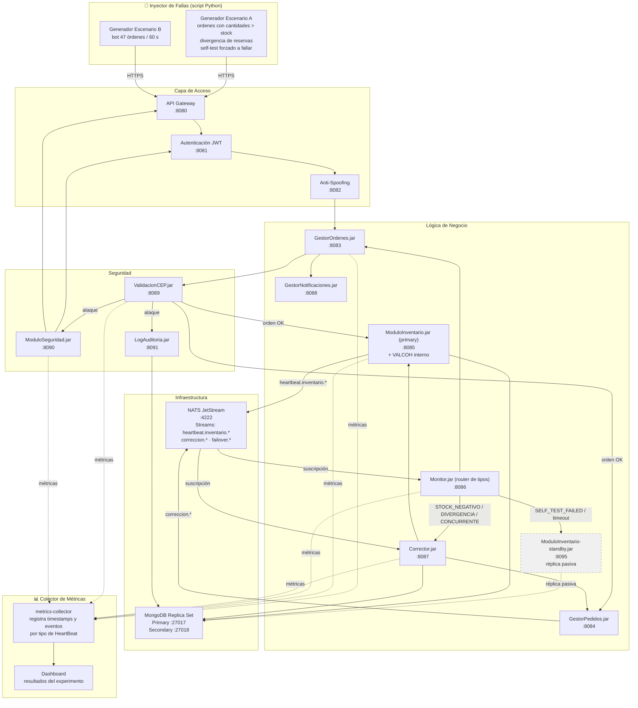
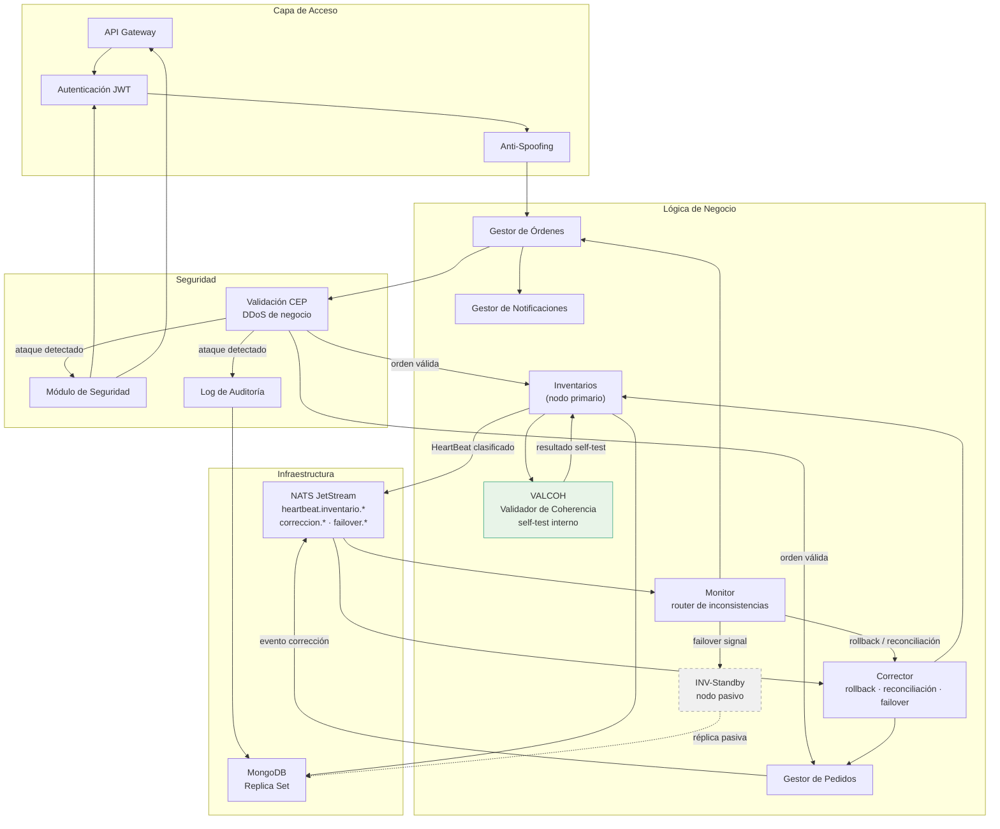
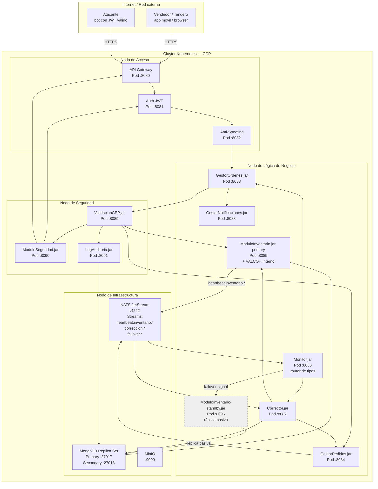
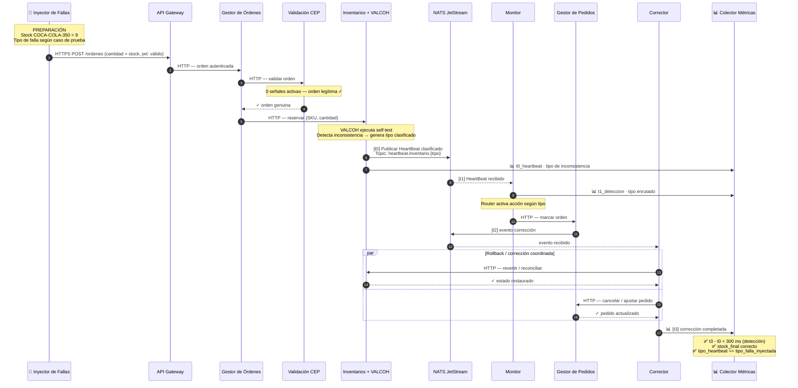
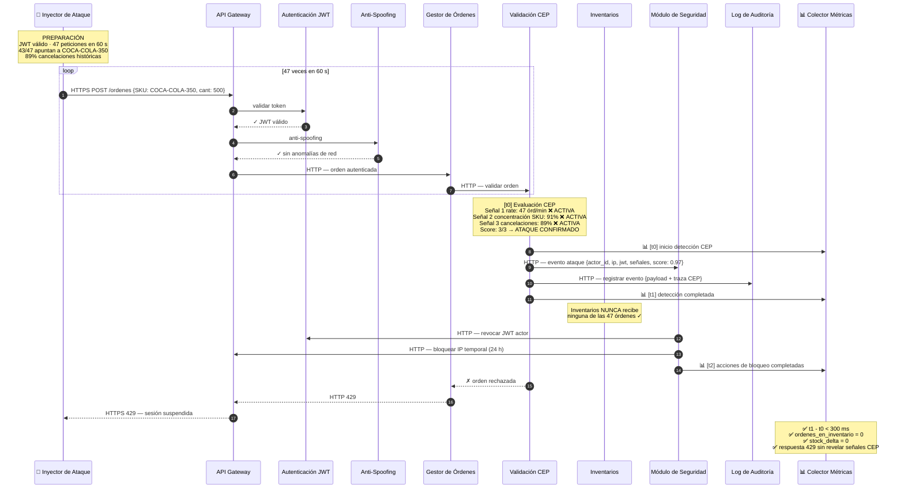
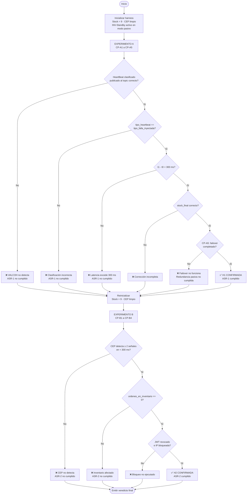

# Diseño del Experimento — Validación de ASRs de Disponibilidad y Seguridad (CCP)

> Agente: `arquitecto-experimentos`
> Reto 2 — ARTI4109 Arquitectura de Software · Universidad de los Andes · MATI

---

## 1. ASRs que se validan

### ASR-1 · Disponibilidad — Detección de cualquier inconsistencia de inventario

| Campo | Valor |
|---|---|
| Actor | Vendedor / Tendero |
| Estímulo | Reserva de un producto |
| Ambiente | 7×24×365 · 5 países · 1.000 usuarios concurrentes · 25 pedidos/s |
| Artefacto | Módulo de Inventarios |
| Respuesta esperada | El sistema debe detectar cualquier inconsistencia que se presente en el inventario en cuanto a las cantidades de los productos se refiere |
| Medida | Detección < 300 ms |
| Impacto negativo | Latencia — las validaciones adicionales de coherencia de stock (self-test) pueden afectar la latencia del ciclo de HeartBeat |

### ASR-2 · Seguridad — Detección de ataque DoS de capa de negocio

| Campo | Valor |
|---|---|
| Actor | Tendero (o bot que lo suplanta con JWT válido) |
| Estímulo | Secuencia de solicitudes de pedido anómalas en ventana de 60 s |
| Ambiente | Ídem ASR-1 |
| Artefacto | Gestor de Pedidos / Inventarios |
| Respuesta esperada | El sistema identifica el patrón CEP y bloquea las órdenes fantasma antes de que afecten el stock |
| Medida | Identificación < 300 ms |

---

## 2. Hipótesis

### H1 — Detección de cualquier inconsistencia de inventario (ASR-1)

> **Si** el Módulo de Inventarios ejecuta su Validador de Coherencia (VALCOH) en cada ciclo de HeartBeat y detecta cualquiera de las cuatro clases de inconsistencia (stock negativo, divergencia de reservas, estado concurrente divergente, o fallo estructural de self-test), **entonces** publica un HeartBeat clasificado al topic NATS correspondiente y el Monitor lo consume, clasifica el tipo y activa la respuesta correcta en menos de 300 ms desde la publicación.

**Clases de inconsistencia cubiertas:**

| Tipo | Topic NATS | Respuesta del Monitor |
|---|---|---|
| `STOCK_NEGATIVO` | `heartbeat.inventario.stock_negativo` | Rollback vía Corrector |
| `DIVERGENCIA_RESERVAS` | `heartbeat.inventario.divergencia_reservas` | Reconciliación vía Corrector |
| `ESTADO_CONCURRENTE` | `heartbeat.inventario.estado_concurrente` | Resolución de conflicto (timestamp menor gana) |
| `SELF_TEST_FAILED` | `heartbeat.inventario.self_test_failed` | Failover a INV-Standby |

### H2 — Detección de DDoS de negocio (ASR-2)

> **Si** un actor genera ≥ 2 de las 3 señales CEP (rate anómalo, concentración de SKU, tasa de cancelación histórica) dentro de una ventana deslizante de 60 s, **entonces** el sistema identifica el patrón como ataque, bloquea la orden en la Validación CEP en menos de 300 ms — sin que ninguna orden del atacante llegue a Inventarios ni al Gestor de Pedidos.

---

## 3. Arquitectura del harness de simulación

El harness replica la arquitectura real del sistema CCP con Docker Compose en lugar de Kubernetes. Cada servicio corre como contenedor independiente con los mismos protocolos de producción (HTTP interno, NATS para eventos, MongoDB para persistencia).

### 3.1 Diagrama del harness



### 3.2 Diagrama de Componentes (arquitectura actualizada)



### 3.3 Diagrama de Despliegue (infraestructura actualizada)



### 3.4 Estado inicial del inventario

| SKU | Stock inicial | Propósito |
|---|---|---|
| `COCA-COLA-350` | 9 unidades | SKU objetivo de los experimentos de inconsistencia |
| `AGUA-500` | 100 unidades | SKU de control (órdenes legítimas) |
| `ARROZ-1KG` | 50 unidades | SKU de control |

### 3.5 Esquema del HeartBeat expandido

```json
{
  "tipo": "STOCK_NEGATIVO | DIVERGENCIA_RESERVAS | ESTADO_CONCURRENTE | SELF_TEST_OK | SELF_TEST_FAILED",
  "timestamp_ms": 1742820000123,
  "nodo": "inv-primary",
  "inconsistencias": [
    {
      "SKU": "COCA-COLA-350",
      "stock_real": -1,
      "stock_esperado": 9,
      "delta": -10
    }
  ],
  "self_test": {
    "resultado": "OK | FAILED",
    "checks_ejecutados": ["stock_negativo", "suma_reservas", "reservas_huerfanas"],
    "check_fallido": null
  }
}
```

El Colector de Métricas suscribe a `metrics.*` y a `heartbeat.inventario.*` para capturar todos los eventos con sus timestamps.

---

## 4. Experimento A — Validación de H1 (ASR-1 · cualquier inconsistencia de inventario)

**Escenario de referencia:** `ASR_escenario2_heartbeat_negativo.md`

### 4.1 Cómo se simula la falla

Cada caso de prueba inyecta una clase distinta de inconsistencia. El inyector envía peticiones al API Gateway con JWT válido de un tendero legítimo — nada es sospechoso a nivel de seguridad. La falla es exclusivamente de inventario.



### 4.2 Cómo se detecta que la falla fue manejada

| Evidencia | Qué se verifica | Cómo se obtiene |
|---|---|---|
| HeartBeat publicado al topic correcto | `topic == heartbeat.inventario.{tipo_esperado}` | Log del Colector / NATS monitor |
| Tipo del HeartBeat correcto | `payload.tipo == tipo_falla_inyectada` | Log del Colector |
| Stock restaurado | `stock_final == stock_pre_falla` | `GET /inventario/COCA-COLA-350` |
| Pedido cancelado / ajustado | Estado del pedido correcto | `GET /pedidos/{orden_id}` |
| Tiempo de detección < 300 ms | `t1 - t0 < 300` | Calculado por el Colector |
| Notificación enmascarada | Mensaje sin trazas internas | Log de GestorNotificaciones |

### 4.3 Casos de prueba

#### CP-A1 — Happy path (control negativo)

| Campo | Valor |
|---|---|
| Orden inyectada | `{SKU: COCA-COLA-350, cantidad: 5}` — cantidad ≤ stock |
| Resultado esperado | Reserva exitosa · VALCOH pasa todos los checks · HeartBeat tipo `SELF_TEST_OK` · Monitor sin acción |
| Evidencia de éxito | Topic `heartbeat.inventario.ok` recibido · ausencia de eventos de corrección |

#### CP-A2 — Stock negativo (clase: `STOCK_NEGATIVO`)

| Campo | Valor |
|---|---|
| Orden inyectada | `{SKU: COCA-COLA-350, cantidad: 10}` — supera stock de 9 |
| Falla simulada | Stock queda en -1 · VALCOH check 1 falla |
| Topic NATS esperado | `heartbeat.inventario.stock_negativo` |
| Detección esperada | Monitor recibe HeartBeat < 300 ms · Corrector ejecuta rollback |
| Stock final esperado | 9 (restaurado) |

#### CP-A3 — Concurrencia: dos órdenes simultáneas (clase: `ESTADO_CONCURRENTE`)

| Campo | Valor |
|---|---|
| Orden 1 | `{COCA-COLA-350, cantidad: 6}` — hilo 1 |
| Orden 2 | `{COCA-COLA-350, cantidad: 6}` — hilo 2, mismo instante |
| Falla simulada | Ambas reservas pasan el check individual, pero juntas exceden el stock |
| Topic NATS esperado | `heartbeat.inventario.estado_concurrente` |
| Stock final esperado | 3 (solo la primera orden confirmada, la segunda revertida) |

#### CP-A4 — Divergencia de reservas (clase: `DIVERGENCIA_RESERVAS`)

| Campo | Valor |
|---|---|
| Falla simulada | Inyectar directamente en la BD: `reservas_activas(COCA-COLA-350) = 7` pero `stock_actual = 5` (diferencia de 2 unidades) sin ninguna transacción en curso |
| Mecanismo de detección | VALCOH check 2 detecta: `suma_reservas(7) ≠ stock_inicial(9) - stock_actual(5)` |
| Topic NATS esperado | `heartbeat.inventario.divergencia_reservas` |
| Acción del Monitor | Reconciliación: Corrector recalcula y ajusta el stock real |
| Propósito | Valida que el self-test detecta inconsistencias que no emergen de una transacción activa |

#### CP-A5 — Fallo estructural de self-test → failover (clase: `SELF_TEST_FAILED`)

| Campo | Valor |
|---|---|
| Falla simulada | Forzar fallo del VALCOH (ej. corrupción del contador de versión) mediante endpoint de inyección de fallas |
| Topic NATS esperado | `heartbeat.inventario.self_test_failed` |
| Acción del Monitor | Publicar señal de failover a `failover.inventario` → INV-Standby se promueve a primario |
| Evidencia de failover | Peticiones posteriores son atendidas por INV-Standby (puerto :8095) |
| Criterio de tiempo | Failover completado < 500 ms (fuera del presupuesto del ASR-1, pero medido) |

### 4.4 Métricas del Experimento A

| Métrica | Origen | Criterio |
|---|---|---|
| `t0_heartbeat` | Timestamp en INV al publicar a NATS | — (referencia) |
| `t1_deteccion` | Timestamp en Monitor al recibir de NATS | `t1 - t0 < 300 ms` ← **criterio ASR-1** |
| `t_self_test` | Duración del VALCOH dentro del ciclo INV | `< 50 ms` |
| `t_clasificacion_monitor` | Tiempo del router para despachar por tipo | `< 10 ms` |
| `t2_correccion` | Timestamp en GP al publicar evento de corrección | `t2 - t0 < 150 ms` |
| `t3_rollback` | Timestamp en Corrector al confirmar corrección | `t3 - t0 < 500 ms` |
| `t_failover` | Tiempo hasta que INV-Standby acepta escrituras (CP-A5) | `< 500 ms` |
| `tipo_heartbeat` | Campo `tipo` en el payload | Debe coincidir con el tipo de falla inyectada |
| `stock_final` | `GET /inventario/COCA-COLA-350` | == stock pre-falla |
| `mensaje_tendero` | Log de GestorNotificaciones | Sin trazas internas del sistema |

---

## 5. Experimento B — Validación de H2 (ASR-2 · DDoS de negocio)

**Escenario de referencia:** `ASR_escenario3_ddos_detectado.md`

### 5.1 Cómo se simula el ataque

El inyector actúa como un bot con **JWT válido** (generado por el mismo sistema). Envía 47 peticiones en 60 segundos concentradas en el mismo SKU. El ataque pasa la Capa de Acceso (JWT válido, IP normal) y solo es detectable por el patrón semántico en la Validación CEP.



### 5.2 Cómo se detecta que el ataque fue bloqueado

| Evidencia | Qué se verifica | Cómo se obtiene |
|---|---|---|
| Evento en Log de Auditoría | Registro del ataque en MongoDB | `db.auditoria.findOne({actor_id: "bot_8821"})` |
| Inventario intacto | `stock(COCA-COLA-350) == stock_inicial` | `GET /inventario/COCA-COLA-350` |
| JWT revocado | Token inválido en peticiones posteriores | Nueva petición con mismo JWT → debe retornar 401 |
| IP bloqueada | IP en lista del API Gateway | `GET /gateway/blocklist` |
| Tiempo CEP < 300 ms | `t1 - t0 < 300` | Colector de métricas |

### 5.3 Casos de prueba

#### CP-B1 — Tendero legítimo (control negativo)

| Campo | Valor |
|---|---|
| Actor | `tendero_001` con JWT válido · 4 órdenes en 60 s · SKUs variados · 0% cancelaciones |
| Señales CEP | 0 activas |
| Resultado esperado | Sin bloqueo · órdenes procesadas · sin eventos de seguridad |

#### CP-B2 — Ataque completo: 3 señales activas (caso crítico)

| Campo | Valor |
|---|---|
| Actor | `bot_8821` · 47 órdenes en 60 s · 43 con `COCA-COLA-350` · 89% cancelaciones |
| Señales CEP | Rate ❌ · Concentración ❌ · Cancelaciones ❌ |
| Resultado esperado | Bloqueado < 300 ms · stock intacto · JWT revocado · IP bloqueada |

#### CP-B3 — Una señal activa (validación de falso positivo)

| Campo | Valor |
|---|---|
| Actor | `tendero_002` · rate alto (8 órd/min) · SKUs variados · 0% cancelaciones |
| Señales CEP | Solo rate ❌ (1/3) |
| Resultado esperado | Orden **NO bloqueada** — 1 señal no alcanza el umbral ≥ 2 |

#### CP-B4 — Dos señales activas (umbral mínimo)

| Campo | Valor |
|---|---|
| Actor | `bot_5555` · rate alto ❌ · concentración SKU ❌ · cancelaciones dentro del umbral ✓ |
| Señales CEP | 2/3 activas |
| Resultado esperado | Orden bloqueada — igual que CP-B2 |

### 5.4 Métricas del Experimento B

| Métrica | Origen | Criterio |
|---|---|---|
| `t0_inicio_cep` | Timestamp en VS al iniciar evaluación | — (referencia) |
| `t1_deteccion` | Timestamp en VS al confirmar ataque | `t1 - t0 < 300 ms` ← **criterio ASR-2** |
| `t2_bloqueo` | Timestamp en SEG al completar JWT + IP block | `t2 - t0 < 500 ms` |
| `ordenes_en_inventario` | Contador en Inventarios | `== 0` |
| `stock_delta` | Stock antes vs. después | `== 0` |
| `codigo_respuesta` | Respuesta al inyector | `== 429` |
| `cuerpo_respuesta` | Cuerpo del 429 | Sin "rate", "SKU", "CEP" ni umbrales |

---

## 6. Diagrama de flujo de decisión del experimento



---

## 7. Trade-offs observables en el experimento

| Trade-off | Dónde se mide | Decisión arquitectónica |
|---|---|---|
| Self-test añade cómputo local (ASR-1) | `t_self_test` en cada ciclo | VALCOH opera en memoria (< 50 ms); no consulta MongoDB en el path crítico |
| HeartBeat expandido aumenta tráfico en NATS | Tamaño del payload en el Colector | El payload expandido es < 1 KB; NATS JetStream soporta hasta 1 MB; sin impacto práctico |
| Router del Monitor añade paso de clasificación | `t_clasificacion_monitor` | El switch por tipo es O(1); latencia adicional < 10 ms |
| INV-Standby consume recursos en idle | Pod idle en Kubernetes | Se implementa con requests/limits mínimos (no recibe tráfico en condiciones normales) |
| Redundancia activa rechazada | — | Exigiría consenso distribuido (Raft/Paxos) y añadiría latencia al path crítico de reserva, incompatible con < 300 ms del ASR-1 |
| Latencia del CEP (siempre activo, ASR-2) | `t1 - t0` en CP-B1 | El CEP evalúa cada orden; si supera 300 ms bajo carga de 25 req/s, se requiere escalar horizontalmente la Validación CEP |

---

## 8. Procedimiento de ejecución

```
1. SETUP DEL HARNESS
   a. docker-compose up (levanta todos los contenedores)
   b. Inicializar MongoDB: stock COCA-COLA-350 = 9, AGUA-500 = 100, ARROZ-1KG = 50
   c. Inicializar NATS: crear streams heartbeat.inventario.*, correccion.*, failover.*
   d. Verificar que INV-Standby está replicando (Secondary en el replica set)
   e. Verificar Colector suscrito a metrics.* y heartbeat.inventario.*
   f. GET /health en cada servicio → 200 OK

2. EXPERIMENTO A — Inconsistencias de inventario (ASR-1)
   a. CP-A1 (control) → verificar HeartBeat tipo SELF_TEST_OK, sin correcciones
   b. Reinicializar stock = 9
   c. CP-A2 (stock negativo) → registrar t0, t1 → verificar tipo STOCK_NEGATIVO, rollback, stock = 9
   d. Reinicializar stock = 9
   e. CP-A3 (concurrencia) → lanzar dos hilos paralelos → verificar ESTADO_CONCURRENTE, stock = 3
   f. Reinicializar stock = 9
   g. CP-A4 (divergencia) → inyectar divergencia en BD → verificar DIVERGENCIA_RESERVAS, reconciliación
   h. Reinicializar stock = 9
   i. CP-A5 (failover) → forzar SELF_TEST_FAILED → verificar failover a INV-Standby, t_failover < 500 ms
   j. Documentar: H1 CONFIRMADA o REFUTADA + métricas

3. EXPERIMENTO B — DDoS de negocio (ASR-2)
   a. CP-B1 (control) → verificar sin bloqueo
   b. Reinicializar ventana CEP
   c. CP-B2 (ataque 3 señales) → registrar t0, t1 → verificar bloqueo, stock intacto, JWT revocado
   d. Verificar JWT inválido: POST /ordenes con mismo token → 401
   e. Reinicializar CEP + unlock JWT + unlock IP
   f. CP-B3 (1 señal) → verificar que orden NO fue bloqueada
   g. Reinicializar CEP
   h. CP-B4 (2 señales) → verificar bloqueo igual que CP-B2
   i. Documentar: H2 CONFIRMADA o REFUTADA + métricas

4. ANÁLISIS DE RESULTADOS
   a. Exportar CSV con métricas del Colector
   b. Calcular percentiles p50/p95/p99 de t1-t0 para A y B
   c. Verificar invariantes de inventario en ambos experimentos
   d. Documentar trade-offs observados
   e. Emitir veredicto por ASR
```

---

## 9. Criterio final de validación de la arquitectura

La arquitectura propuesta **cumple los ASRs** si se cumplen todas las condiciones:

| # | Condición | ASR | Veredicto posible |
|---|---|---|---|
| 1 | `t1 - t0 < 300 ms` para los 4 tipos de inconsistencia (CP-A2 a CP-A5) | ASR-1 | CUMPLIDO / NO CUMPLIDO |
| 2 | `tipo_heartbeat == tipo_falla_inyectada` en todos los casos | ASR-1 (precisión) | CUMPLIDO / NO CUMPLIDO |
| 3 | `stock_final == stock_pre_falla` tras rollback / reconciliación | ASR-1 | CUMPLIDO / NO CUMPLIDO |
| 4 | Failover a INV-Standby completado en CP-A5 | ASR-1 (redundancia pasiva) | CUMPLIDO / NO CUMPLIDO |
| 5 | `t1 - t0 < 300 ms` en CP-B2 (detección CEP) | ASR-2 | CUMPLIDO / NO CUMPLIDO |
| 6 | `ordenes_en_inventario == 0` y `stock_delta == 0` en CP-B2 | ASR-2 | CUMPLIDO / NO CUMPLIDO |
| 7 | CP-B3 no fue bloqueado (falso positivo) | ASR-2 (precisión) | ACEPTABLE / NO ACEPTABLE |

Si alguna condición falla, el experimento identifica qué componente introduce la desviación y orienta el ajuste arquitectónico necesario.
