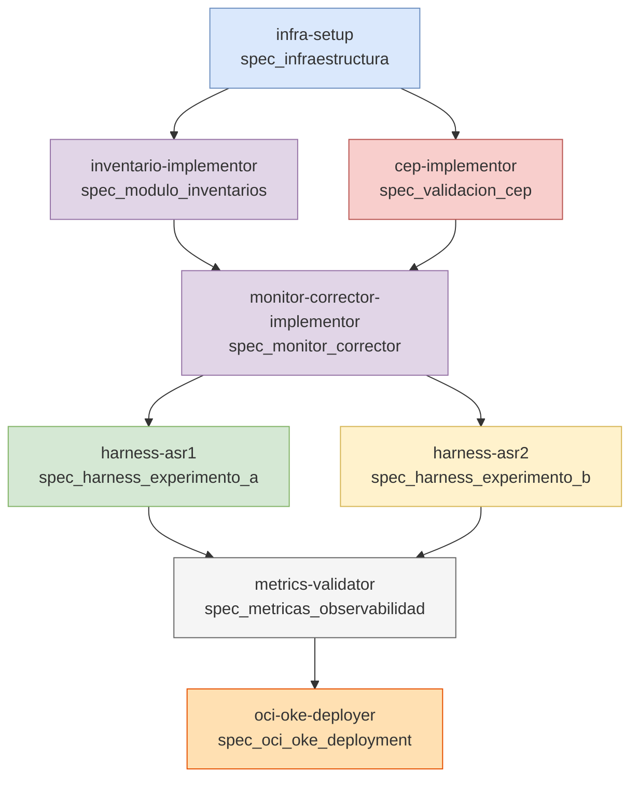

# Plan de Trabajo — Implementacion y Validacion de ASRs CCP

## Resumen Ejecutivo

Este plan materializa el diseño del experimento (`.claude/diseño_experimento.md`) en
una implementacion ejecutable localmente. El objetivo es **demostrar empíricamente**
que la arquitectura del CCP cumple sus dos atributos de calidad:

- **ASR-1 (Disponibilidad)**: El sistema detecta cualquier inconsistencia de inventario
  y la clasifica correctamente en menos de 300 ms, usando VALCOH (self-test interno)
  + HeartBeat expandido sobre NATS JetStream.

- **ASR-2 (Seguridad)**: El sistema detecta un ataque DDoS de capa de negocio via CEP
  y bloquea al atacante en menos de 300 ms, sin afectar tenderos legítimos.

El experimento se ejecuta sobre un **cluster Kubernetes local (Kind)** con 1
control-plane + 2 worker nodes. Los servicios son microservicios Python/FastAPI.
La validacion final se ejecuta con un comando unico: `python scripts/validate_asrs.py`.

---

## Tecnologías del Stack

| Capa | Tecnología | Justificación |
|---|---|---|
| Orquestación local | Kind (Kubernetes IN Docker) | Multi-nodo real; failover observable via `kubectl get pods -w`; refleja diagrama de despliegue |
| Servicios | Python 3.11 + FastAPI | Serialización JSON nativa para HeartBeat; bajo overhead; rápido de implementar |
| Broker de mensajes | NATS JetStream (Helm `nats/nats`) | Topics clasificados por tipo para filtrado nativo sin parsear payloads |
| Base de datos | MongoDB Replica Set (Helm `bitnami/mongodb`) | Replicación Primary/Secondary necesaria para INV-Standby y failover real |
| Scripts de simulación | Python puro (`httpx`, `nats-py`, `pymongo`) | Sin frameworks pesados; cada script es autocontenido y emite resultado JSON |

---

## Estructura del Repositorio

```
/
├── k8s/                          # Manifiestos Kubernetes
│   ├── kind-config.yaml          # Cluster: 1 control-plane + 2 workers
│   ├── namespaces.yaml
│   ├── modulo-inventarios.yaml   # Deployment + Service (primario :8090)
│   ├── inv-standby.yaml          # Deployment + Service (standby :8095)
│   ├── monitor.yaml
│   ├── corrector.yaml
│   ├── validacion-cep.yaml
│   ├── modulo-seguridad.yaml
│   └── log-auditoria.yaml
│
├── services/                     # Microservicios FastAPI
│   ├── modulo_inventarios/       # INV + VALCOH interno
│   ├── monitor/                  # Monitor router por tipo HeartBeat
│   ├── corrector/                # Rollback + reconciliacion
│   ├── validacion_cep/           # Motor CEP + ventana deslizante
│   ├── modulo_seguridad/         # Revocacion JWT + bloqueo IP
│   └── log_auditoria/            # Persistencia forense independiente
│
├── experiments/
│   ├── experiment_a/             # CP-A1 a CP-A5 (ASR-1)
│   └── experiment_b/             # CP-B1 a CP-B4 (ASR-2)
│
└── scripts/
    ├── validate_asrs.py          # Entry point: ejecuta todo el experimento
    ├── metrics_collector.py
    └── report_generator.py
```

---

## Diagrama de Dependencias entre Agentes



---

## Fases y Secuencia de Ejecución

### Fase 1 — Infraestructura (Agente: `infra-setup`)

**Prerequisitos del operador:**
```bash
brew install kind kubectl helm
docker --version  # Docker Desktop debe estar corriendo
```

**Lo que hace el agente:**
1. Crear cluster Kind con `kind-config.yaml` (3 nodos)
2. Instalar NATS JetStream via Helm y crear 3 streams
3. Instalar MongoDB Replica Set via Helm (Primary en worker-1, Secondary en worker-2)
4. Crear namespaces `ccp`, `data`, `messaging`
5. Ejecutar script de verificacion `scripts/verify_infra.sh`

**Criterio de salida:** `kubectl get pods -A` muestra NATS y MongoDB en Running.

---

### Fase 2 — Implementacion de Servicios (Agentes en paralelo)

#### 2a. `inventario-implementor` — ModuloInventarios + INV-Standby

Spec: `spec_modulo_inventarios.md`

Implementa:
- `services/modulo_inventarios/` — FastAPI con VALCOH (3 checks), HeartBeat a 5 topics NATS, endpoint `/reservar`, `/fault-inject`, `/reset`
- `services/inv_standby/` — Pod pasivo en :8095, replica MongoDB, sin HeartBeat hasta failover
- `k8s/modulo-inventarios.yaml` + `k8s/inv-standby.yaml`

Criterio de salida: `nats sub "heartbeat.inventario.>"` recibe HeartBeats clasificados.

#### 2b. `cep-implementor` — ValidacionCEP + ModuloSeguridad + LogAuditoria

Spec: `spec_validacion_cep.md`

Implementa:
- `services/validacion_cep/` — Motor CEP con ventana deslizante 60 s, 3 senales, respuesta 429 enmascarada
- `services/modulo_seguridad/` — Revocacion JWT, bloqueo IP temporal, endpoint `/blocklist`
- `services/log_auditoria/` — Persistencia forense independiente
- `k8s/validacion-cep.yaml`, `k8s/modulo-seguridad.yaml`, `k8s/log-auditoria.yaml`

Criterio de salida: 10 ordenes del mismo actor mismo SKU → 429 con cuerpo enmascarado.

---

### Fase 3 — Monitor y Corrector (Agente: `monitor-corrector-implementor`)

Spec: `spec_monitor_corrector.md`

**Depende de:** Fase 2a (necesita que NATS tenga HeartBeats del inventario)

Implementa:
- `services/monitor/` — Suscripcion a `heartbeat.inventario.*`, router por tipo:
  - `STOCK_NEGATIVO` → HTTP al Corrector (rollback)
  - `DIVERGENCIA_RESERVAS` → HTTP al Corrector (reconciliacion)
  - `ESTADO_CONCURRENTE` → HTTP al Corrector (resolucion de conflicto)
  - `SELF_TEST_FAILED` + timeout → activacion de INV-Standby
- `services/corrector/` — Endpoints de rollback y reconciliacion coordinados con MongoDB
- `k8s/monitor.yaml`, `k8s/corrector.yaml`

Criterio de salida: inyectar stock negativo → Monitor detecta HeartBeat → Corrector ejecuta rollback → stock restaurado.

---

### Fase 4 — Scripts de Simulacion (Agentes en paralelo)

#### 4a. `harness-asr1` — Experimento A (CP-A1 a CP-A5)

Spec: `spec_harness_experimento_a.md`

Implementa `experiments/experiment_a/` con 5 scripts + orquestador.

Criterio de salida: `python experiments/experiment_a/run_experiment_a.py` termina con `H1: CONFIRMADA`.

#### 4b. `harness-asr2` — Experimento B (CP-B1 a CP-B4)

Spec: `spec_harness_experimento_b.md`

Implementa `experiments/experiment_b/` con 4 scripts + orquestador.

Criterio de salida: `python experiments/experiment_b/run_experiment_b.py` termina con `H2: CONFIRMADA`.

---

### Fase 5 — Validacion Final (Agente: `metrics-validator`)

Spec: `spec_metricas_observabilidad.md`

**Depende de:** Todas las fases anteriores completas.

Implementa `scripts/validate_asrs.py`, `scripts/metrics_collector.py`,
`scripts/report_generator.py`.

**Comando unico de validacion:**
```bash
cd /ruta/al/proyecto
python scripts/validate_asrs.py
```

**Resultado esperado:**
```
======================================================================
VALIDACION COMPLETA DE ASRs -- CCP
======================================================================

>>> EXPERIMENTO A: Inconsistencias de inventario (ASR-1)
>>> EXPERIMENTO B: DDoS de negocio (ASR-2)

TABLA DE RESULTADOS
----------------------------------------------------------------------
Caso     Veredicto  t_deteccion (ms)   Criterio        Resultado
CP-A1    PASS       N/A                Control         PASS
CP-A2    PASS       42.3               < 300 ms        PASS
CP-A3    PASS       67.8               < 300 ms        PASS
CP-A4    PASS       89.1               < 300 ms        PASS
CP-A5    PASS       312.4              < 500 ms        PASS
CP-B1    PASS       N/A                Control         PASS
CP-B2    PASS       28.7               < 300 ms        PASS
CP-B3    PASS       N/A                No bloquear     PASS
CP-B4    PASS       31.2               < 300 ms        PASS

======================================================================
VEREDICTO FINAL
======================================================================
  H1 (ASR-1 Disponibilidad): CONFIRMADA
  H2 (ASR-2 Seguridad):      CONFIRMADA

Reporte generado: resultados_experimento.md
```

---

### Fase 6 — Despliegue Multi-entorno: Local Kind + OCI OKE (Agente: `oci-oke-deployer`)

Spec: `spec_oci_oke_deployment.md`

**Depende de:** Todas las fases anteriores completas (1-5). El experimento debe estar validado
en local con 9/9 PASS antes de intentar el despliegue en OCI.

**Objetivo:** Proveer dos modos de despliegue intercambiables para el experimento CCP,
controlados por la variable `DEPLOY_TARGET=local|oci`. El modo local usa Kind (ya validado);
el modo OCI despliega en un cluster OKE real demostrando que los ASRs se cumplen en
infraestructura cloud de produccion. Los scripts de experimento no se modifican en ningun caso.

**Lo que hace el agente:**

*Modo local (`DEPLOY_TARGET=local`):*
1. Verificar prerequisitos locales (Docker, Kind, kubectl, Helm — sin credenciales OCI)
2. Ejecutar `bash infra/setup.sh` (cluster Kind + NATS + MongoDB + streams + seed)
3. Ejecutar `bash infra/build-and-load.sh` (build + kind load de 6 imagenes)
4. Aplicar manifiestos `kubectl apply -f k8s/` (NodePort, imagePullPolicy: Never)
5. Ejecutar experimentos via `bash scripts/run_experiments.sh` (port-forward + 9 casos)

*Modo OCI (`DEPLOY_TARGET=oci`):*
1. Verificar prerequisitos OCI (CLI, kubectl, Docker, variables de entorno)
2. Provisionar cluster OKE con 3 workers (VM.Standard.E4.Flex, 2 OCPUs, 8 GB RAM)
3. Build + push de las 6 imagenes Docker a OCIR (OCI Container Registry)
4. Crear imagePullSecret para OCIR en los 3 namespaces
5. Instalar NATS JetStream via Helm con PVC en OCI Block Volume
6. Instalar MongoDB Replica Set via Helm con StorageClass `oci-bv` (50 GB por nodo)
7. Aplicar overlay Kustomize (`k8s/overlays/oci/`) que adapta: imagePullPolicy, imagePullSecrets, NodePort→LoadBalancer, OCIR image refs, remocion de nodeSelector
8. Crear los 3 streams NATS (HEARTBEAT_INVENTARIO, CORRECCION, FAILOVER)
9. Inicializar MongoDB con seed (`init_inventory.py`)
10. Verificar health checks via IPs publicas del Load Balancer
11. Ejecutar los 9 casos de prueba via port-forward
12. Generar reporte final en OKE

**Archivos creados:**
- `infra/deploy.sh` — orquestador unificado (`DEPLOY_TARGET=local|oci`)
- `infra/oci/setup_oke.sh` — provisionamiento del cluster OKE
- `infra/oci/teardown_oke.sh` — eliminacion limpia de recursos
- `infra/oci/ocir_push.sh` — build + tag + push de imagenes
- `infra/oci/imagepullsecret.sh` — secret de autenticacion OCIR
- `infra/oci/mongodb-values-oci.yaml` — Helm values MongoDB para OKE
- `infra/oci/nats-values-oci.yaml` — Helm values NATS para OKE
- `infra/oci/deploy_services.sh` — despliegue de servicios con Kustomize
- `infra/oci/verify_oci.sh` — verificacion end-to-end
- `k8s/overlays/oci/kustomization.yaml` — overlay Kustomize
- `k8s/overlays/oci/patch-services-lb.yaml` — NodePort→LoadBalancer
- `k8s/overlays/oci/patch-imagepull.yaml` — imagePullSecrets + imagePullPolicy
- `k8s/overlays/oci/patch-remove-nodeselector.yaml` — remueve nodeSelector

**Criterio de salida:**
- Modo local: 9/9 casos PASS en Kind (ya validado 2026-04-04)
- Modo OCI: todos los pods en `Running` en OKE + Load Balancer IPs accesibles + 9/9 PASS
- Ambos: H1 y H2 CONFIRMADAS; scripts de experimento no modificados

---

## Tabla de Agentes

| Agente | Spec | Outputs principales | Dependencias |
|---|---|---|---|
| `infra-setup` | `spec_infraestructura.md` | Cluster Kind, NATS, MongoDB | Ninguna |
| `inventario-implementor` | `spec_modulo_inventarios.md` | `services/modulo_inventarios/`, `services/inv_standby/` | `infra-setup` |
| `cep-implementor` | `spec_validacion_cep.md` | `services/validacion_cep/`, `services/modulo_seguridad/` | `infra-setup` |
| `monitor-corrector-implementor` | `spec_monitor_corrector.md` | `services/monitor/`, `services/corrector/` | `inventario-implementor` |
| `harness-asr1` | `spec_harness_experimento_a.md` | `experiments/experiment_a/` | `monitor-corrector-implementor` |
| `harness-asr2` | `spec_harness_experimento_b.md` | `experiments/experiment_b/` | `cep-implementor` |
| `metrics-validator` | `spec_metricas_observabilidad.md` | `scripts/validate_asrs.py`, `resultados_experimento.md` | `harness-asr1` + `harness-asr2` |
| `oci-oke-deployer` | `spec_oci_oke_deployment.md` | `infra/deploy.sh`, `infra/oci/`, `k8s/overlays/oci/`, 9/9 PASS en Kind y OKE | `metrics-validator` (Fases 1-5 completas) |

---

## Criterios de Exito por ASR

### ASR-1 (Disponibilidad) — H1 CONFIRMADA cuando:
- [ ] CP-A2: `t_deteccion < 300 ms` + stock restaurado a 9 tras rollback
- [ ] CP-A3: HeartBeat ESTADO_CONCURRENTE + stock_final == 3
- [ ] CP-A4: HeartBeat DIVERGENCIA_RESERVAS + reconciliacion ejecutada
- [ ] CP-A5: HeartBeat SELF_TEST_FAILED + `t_failover < 500 ms` + INV-Standby funcional

### ASR-2 (Seguridad) — H2 CONFIRMADA cuando:
- [ ] CP-B2: `t_deteccion < 300 ms` + JWT revocado + IP bloqueada + stock intacto + respuesta enmascarada
- [ ] CP-B3: 0 ordenes bloqueadas con 1 sola senal activa (sin falso positivo)
- [ ] CP-B4: bloqueo con exactamente 2 senales activas (umbral minimo funciona)

---

## Troubleshooting Comun

| Problema | Causa probable | Solucion |
|---|---|---|
| Pod en `CrashLoopBackOff` | Variable de entorno faltante o URL incorrecta | `kubectl logs <pod> -n ccp` para ver el error; verificar ConfigMap |
| NATS no conecta | Stream no creado o nombre incorrecto | `nats stream list` para ver streams; recrear con `nats stream add` |
| MongoDB replica set no se forma | Pods no se ven entre nodos | Verificar que los 3 nodos Kind estan en la misma red Docker: `kind get kubeconfig` |
| HeartBeat no llega al Monitor | Topic NATS incorrecto | Verificar con `nats sub "heartbeat.inventario.>"` y comparar con lo que publica INV |
| t_deteccion > 300 ms | VALCOH consultando MongoDB (no cache) | Verificar que VALCOH opera en memoria; revisar logs de `t_self_test` |
| CP-B2 no genera 429 | Rate threshold muy alto o ventana no resetea | Verificar `RATE_THRESHOLD` en config del CEP; usar `POST /reset` entre casos |
| `ImagePullBackOff` en OKE | imagePullSecret incorrecto o imagen no existe en OCIR | `kubectl describe pod <pod> -n ccp`; re-ejecutar `infra/oci/imagepullsecret.sh`; verificar imagen con `oci artifacts container image list` |
| LB sin IP en OKE | Security Lists del subnet no permiten trafico | Verificar reglas de ingress en OCI Console para puertos 8090/8094 |
| PVC `Pending` en OKE | StorageClass `oci-bv` no existe o quota excedida | `kubectl get sc`; verificar service limits en OCI Console |

---

## Orden de Invocacion de Agentes (Instrucciones Operativas)

Para ejecutar el plan, invocar los agentes en este orden desde Claude Code:

```
1. @infra-setup         → provisiona el cluster Kind local
2. @inventario-implementor y @cep-implementor (en paralelo)
3. @monitor-corrector-implementor
4. @harness-asr1 y @harness-asr2 (en paralelo)
5. @metrics-validator   → validacion final en local
6. @oci-oke-deployer    → migra a OCI/OKE y valida en cloud
```

Cada agente lee su spec en `.claude/specs/` y produce los archivos especificados
en la seccion "Outputs Esperados" de esa spec.

**Nota sobre Fase 6:** El agente `oci-oke-deployer` soporta dos modos de despliegue:
- `DEPLOY_TARGET=local` — usa Kind, no requiere credenciales cloud (ya validado)
- `DEPLOY_TARGET=oci` — requiere cuenta OCI activa con variables `OCI_REGION`,
  `OCI_TENANCY_NAMESPACE`, `OCI_COMPARTMENT_ID`, `OCIR_USERNAME`, `OCIR_PASSWORD`

Punto de entrada unificado: `DEPLOY_TARGET=<modo> bash infra/deploy.sh`.
Ver `.claude/specs/spec_oci_oke_deployment.md` para los prerequisitos completos de cada modo.
