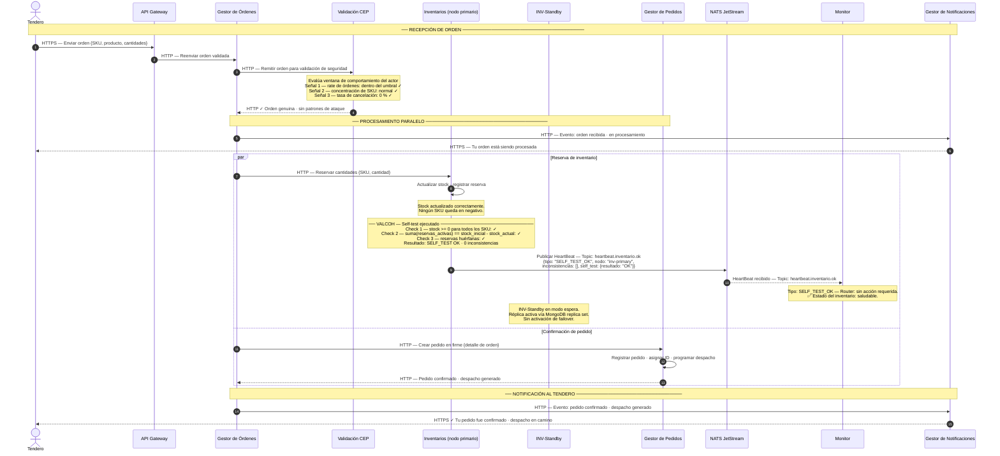

# ASR 1 — Escenario 1: Flujo exitoso (HeartBeat OK · Self-test sin inconsistencias)

**Contexto:** El tendero genera una orden válida. La Validación CEP no detecta patrones de ataque, el inventario es suficiente para cubrir las cantidades solicitadas y el Validador de Coherencia (VALCOH) de Inventarios ejecuta su self-test sin encontrar inconsistencias. El HeartBeat publicado es de tipo `SELF_TEST_OK`. El Monitor no toma acción. INV-Standby permanece en modo pasivo. El Monitor y el Corrector están activos y suscritos en todo momento, pero no tienen eventos que procesar.

**Tácticas activas:**
- Disponibilidad → **Detección**: Self-test (VALCOH) — Inventarios verifica coherencia de stock en cada ciclo; en este escenario no hay inconsistencias
- Disponibilidad → **Detección**: HeartBeat expandido vía NATS JetStream — tipo `SELF_TEST_OK` confirma estado saludable
- Disponibilidad → **Redundancia Pasiva**: INV-Standby en modo espera — réplica activa vía MongoDB replica set
- Seguridad → **Detección**: Validación CEP (DDoS / orden fantasma) antes de reservar
- Seguridad → **Resistir**: Orden no pasa a Inventarios ni a Gestor de Pedidos sin superar la validación

---

## Diagrama de secuencia

---

## Notas de arquitectura

| Elemento | Táctica | Detalle |
|---|---|---|
| API Gateway como punto de entrada | Capa de Acceso — control de tráfico | Toda solicitud del tendero entra por HTTPS al API Gateway; los servicios internos nunca quedan expuestos directamente a internet |
| Validación CEP previa al procesamiento | Detectar ataques — CEP / DDoS (ASR 2) | La orden no llega a Inventarios ni a Gestor de Pedidos sin pasar primero la validación |
| VALCOH — Self-test en cada ciclo de HeartBeat | Detectar fallas — Self-test (ASR 1) | Inventarios ejecuta tres checks internos (stock >= 0, coherencia de reservas, huérfanos) antes de publicar el HeartBeat; en este escenario todos pasan |
| HeartBeat expandido vía NATS JetStream | Detectar fallas — HeartBeat | Inventarios publica al topic `heartbeat.inventario.ok` con tipo `SELF_TEST_OK`; el Monitor suscribe selectivamente al topic sin parsear el payload |
| Monitor sin acción | Detectar fallas — Monitor pasivo | Recibe HeartBeat tipo `SELF_TEST_OK` y no toma ninguna acción; su inactividad es el indicador de que el sistema opera correctamente |
| INV-Standby en modo pasivo | Disponibilidad — Redundancia Pasiva | El nodo standby replica el estado vía MongoDB replica set y está listo para activarse si el Monitor detecta `SELF_TEST_FAILED` o timeout del HeartBeat |
| Procesamiento paralelo | Preparación — Reconfiguración | La reserva de inventario y la confirmación del pedido ocurren simultáneamente para minimizar latencia |
| Notificación a través de Gestor de Notificaciones | Experiencia del actor | El tendero recibe primero "orden recibida" y luego "despacho generado" a través de NOTIF, desacoplando la lógica de negocio de la entrega de mensajes |
| Trade-off: self-test añade cómputo local | Impacto negativo — ASR 1 | El VALCOH opera en memoria (< 50 ms); en el happy path no hay inconsistencia y el self-test no bloquea el flujo de reserva |

> **El Monitor y el Corrector están activos y suscritos en todo momento** — simplemente no tienen eventos que procesar en este escenario. Su ausencia en el flujo es el indicador de que el sistema opera correctamente.

> **INV-Standby siempre replicando:** aunque no procese transacciones en el happy path, INV-Standby mantiene su réplica sincronizada en todo momento. Esto garantiza que un failover, de ser necesario, pueda completarse sin sincronización inicial costosa.
