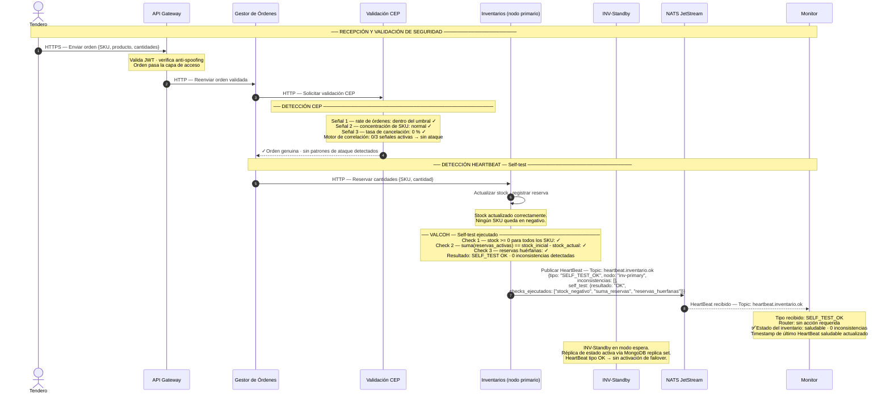

# ASR 1 — Escenario 1 (Solo Detección): Flujo exitoso — HeartBeat OK y CEP sin alertas

**Contexto:** El tendero genera una orden válida. La Validación CEP no detecta patrones de ataque y el Validador de Coherencia (VALCOH) de Inventarios ejecuta su self-test sin encontrar inconsistencias. El HeartBeat publicado a NATS JetStream es de tipo `SELF_TEST_OK`. El Monitor lo consume y confirma que el sistema opera correctamente. INV-Standby permanece en modo pasivo. Este diagrama muestra únicamente los mecanismos de detección activos en el estado saludable del sistema.

**Tácticas de detección activas:**
- Disponibilidad → **Detección**: Self-test (VALCOH) — Inventarios verifica internamente la coherencia de stock; en este escenario todos los checks pasan
- Disponibilidad → **Detección**: HeartBeat expandido — publica tipo `SELF_TEST_OK` a NATS JetStream; el Monitor confirma el estado saludable
- Disponibilidad → **Redundancia Pasiva**: INV-Standby en modo espera — réplica activa, sin activar failover
- Seguridad → **Detección**: Validación CEP — evalúa 3 señales de comportamiento; ninguna supera el umbral

---

## Diagrama de secuencia — Solo detección

---

## Notas de arquitectura — Detección

| Elemento | Táctica | Detalle |
|---|---|---|
| API Gateway + Autenticación JWT + Anti-Spoofing | Detectar — Capa de Acceso | La orden pasa la validación de identidad y red antes de llegar a la lógica de negocio |
| Validación CEP — 3 señales evaluadas | Detectar ataques — CEP (ASR 2) | El motor evalúa rate, concentración de SKU y tasa de cancelación; en este escenario ninguna señal supera el umbral |
| VALCOH — Self-test en cada ciclo | Detectar fallas — Self-test (ASR 1) | Inventarios ejecuta tres checks internamente antes de publicar el HeartBeat; en este escenario todos pasan y el tipo es `SELF_TEST_OK` |
| HeartBeat expandido vía NATS JetStream | Detectar fallas — HeartBeat | Inventarios publica al topic `heartbeat.inventario.ok` con payload clasificado; el Monitor consume selectivamente sin parsear el payload |
| Monitor — router por tipo | Detectar fallas — Monitor pasivo | El Monitor recibe `SELF_TEST_OK` y no toma ninguna acción; su inactividad es la señal de que el sistema opera correctamente |
| INV-Standby en modo pasivo | Disponibilidad — Redundancia Pasiva | El nodo standby mantiene réplica del estado. La ausencia de failover es el indicador de salud del nodo primario |

> **Indicador de salud del sistema:** la combinación de `SELF_TEST_OK` en el HeartBeat, 0 señales activas en la Validación CEP, e inactividad del Monitor son los tres indicadores observables de que ambos ASR operan dentro de los parámetros normales.

> **INV-Standby siempre activo:** aunque no procese transacciones en el happy path, INV-Standby está siempre replicando estado. Esto garantiza que un failover, de ser necesario, pueda completarse rápidamente sin necesidad de sincronización inicial.
