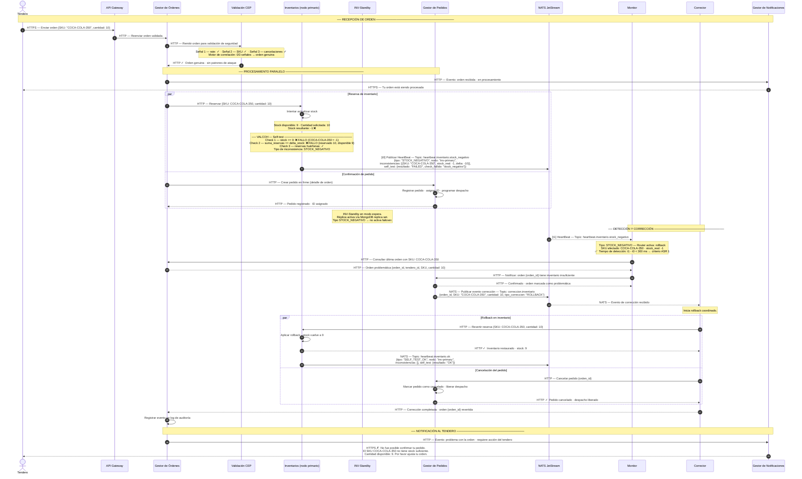

# ASR 1 — Escenario 2: Inventarios detecta inconsistencia → Corrección y rollback

**Contexto:** El tendero genera una orden que pasa la validación de seguridad, pero al reservar el inventario un SKU queda en negativo. El Validador de Coherencia interno (VALCOH) de Inventarios detecta la inconsistencia de tipo `STOCK_NEGATIVO` y la publica como HeartBeat clasificado a NATS JetStream. El Monitor la recibe, la enruta como rollback y activa el Corrector. El rollback coordina inventario y pedido en paralelo. El tendero es notificado con un mensaje enmascarado. El nodo INV-Standby permanece en modo pasivo durante este escenario; se activaría ante `SELF_TEST_FAILED` o timeout del HeartBeat.

**Tácticas activas (ASR 1 — Disponibilidad):**
- Disponibilidad → **Detección**: Self-test (VALCOH) — verifica coherencia de stock en cada ciclo de HeartBeat
- Disponibilidad → **Detección**: HeartBeat expandido — publica tipo `STOCK_NEGATIVO` al topic clasificado en NATS
- Disponibilidad → **Detección**: Monitor como router — clasifica el tipo y activa el flujo de corrección
- Disponibilidad → **Enmascarar**: El tendero recibe una respuesta controlada, sin exponer el error interno
- Disponibilidad → **Corregir**: Monitor activa Corrector → rollback de inventario + cancelación de pedido en paralelo
- Disponibilidad → **Redundancia Pasiva**: INV-Standby en modo espera (no se activa en este escenario)
- Seguridad → **Detección**: Validación CEP — pasa en este escenario (orden genuina)

---

## Diagrama de secuencia

---

## Notas de arquitectura

| Momento | Decisión | Razonamiento |
|---|---|---|
| API Gateway como punto de entrada | Capa de Acceso — control de tráfico | Toda solicitud del tendero entra por HTTPS al API Gateway; los servicios internos operan sobre HTTP en la red privada |
| VALCOH ejecuta self-test en cada ciclo de HeartBeat | Detectar fallas — Self-test (ASR 1) | Inventarios verifica internamente: stock >= 0, suma de reservas == diferencia de stock, y reservas huérfanas. Detecta cualquier clase de inconsistencia de cantidades, no solo stock negativo. |
| HeartBeat publicado a topic clasificado en NATS | Detectar fallas — HeartBeat expandido | El topic `heartbeat.inventario.stock_negativo` permite al Monitor suscribirse selectivamente; el campo `tipo` en el payload elimina un paso de clasificación del path crítico |
| Monitor actúa como router por tipo de inconsistencia | Detectar fallas — Router | El Monitor despacha por tipo: `STOCK_NEGATIVO` → rollback · `DIVERGENCIA_RESERVAS` → reconciliación · `ESTADO_CONCURRENTE` → resolución de conflicto · `SELF_TEST_FAILED` → failover a INV-Standby |
| Monitor recupera la orden del Gestor de Órdenes | Correlación del evento | El SKU afectado en el HeartBeat permite identificar qué orden generó la inconsistencia |
| Gestor de Pedidos publica evento de corrección a NATS | Mensajería asincrónica — NATS JetStream | El Corrector recibe el evento del broker, desacoplado del Monitor; reutilizable para cualquier tipo de rollback |
| Rollback paralelo en inventario y pedidos | Corregir — Rollback coordinado | Ambas correcciones se ejecutan simultáneamente para minimizar la ventana de stock negativo |
| INV-Standby en modo pasivo | Disponibilidad — Redundancia Pasiva | El nodo standby mantiene réplica vía MongoDB replica set. No se activa para `STOCK_NEGATIVO` (el primario permanece operativo). Se activa si el Monitor recibe `SELF_TEST_FAILED` o detecta timeout del HeartBeat. |
| Tendero notificado sin exponer el error interno | Enmascarar — respuesta controlada | El cliente recibe un mensaje accionable (cantidad disponible = 9) a través de NOTIF, sin ver trazas internas del sistema |
| Log de auditoría en Gestor de Órdenes | Recuperarse — Manejo de log de eventos | Permite análisis forense posterior y detección de patrones recurrentes |
| Trade-off: self-test añade latencia local | Impacto negativo — ASR 1 | El VALCOH opera sobre datos en memoria (< 50 ms). El resto del presupuesto de 300 ms lo absorbe la latencia de NATS y el procesamiento del Monitor |

> **Ventana de tiempo en negativo:** existe un intervalo entre t0 (stock queda en -1) y el momento en que el Corrector aplica el rollback. Este intervalo debe minimizarse con HeartBeat de baja latencia. El ASR 1 exige que la **detección** (t1 - t0) sea < 300 ms; la corrección posterior no está dentro del presupuesto del ASR pero debe completarse lo antes posible para proteger la consistencia.

> **Failover ante SELF_TEST_FAILED:** si el VALCOH detectara una inconsistencia estructural irrecuperable (corrupción de contadores, fallo de integridad de versión), el HeartBeat se publicaría en `heartbeat.inventario.self_test_failed`. El Monitor activaría el failover: INV-Standby se promueve a primario vía MongoDB replica set, el Monitor notifica al equipo de operaciones y el nodo primario queda fuera de servicio hasta su recuperación manual.
