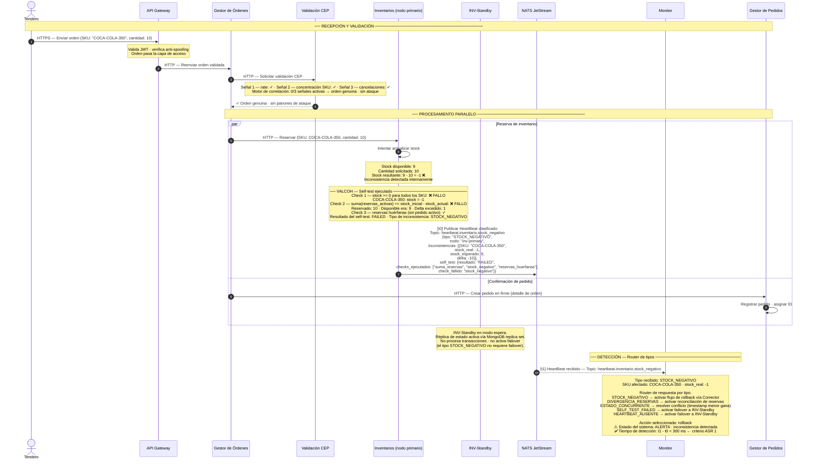

# ASR 1 — Escenario 2 (Solo Detección): Inventarios detecta inconsistencia de stock

**Contexto:** El tendero genera una orden que pasa la validación de seguridad, pero al reservar el inventario un SKU queda en negativo. El Módulo de Inventarios ejecuta su Validador de Coherencia (VALCOH) en cada ciclo de HeartBeat y detecta la inconsistencia de tipo `STOCK_NEGATIVO`. Publica un HeartBeat clasificado al topic `heartbeat.inventario.stock_negativo` en NATS JetStream. El Monitor lo consume, identifica el tipo y determina la respuesta apropiada. Este diagrama muestra únicamente los mecanismos de detección activos: el self-test interno de Inventarios y el enrutamiento por tipo en el Monitor.

**Tácticas de detección activas (ASR 1 — Disponibilidad):**
- Disponibilidad → **Detección**: Self-test (VALCOH) — Inventarios verifica internamente la coherencia de stock en cada ciclo
- Disponibilidad → **Detección**: HeartBeat expandido — publica tipo de inconsistencia al topic clasificado en NATS JetStream
- Disponibilidad → **Detección**: Monitor como router — consume el HeartBeat, clasifica el tipo y determina la respuesta
- Disponibilidad → **Redundancia Pasiva**: INV-Standby en modo espera — se activa solo ante `SELF_TEST_FAILED` o timeout del HeartBeat

---

## Diagrama de secuencia — Solo detección

---

## Notas de arquitectura — Detección (ASR 1)

| Momento | Táctica | Detalle |
|---|---|---|
| VALCOH ejecuta self-test en cada ciclo de HeartBeat | Detectar fallas — Self-test | El Validador de Coherencia verifica tres checks: stock >= 0, suma de reservas == diferencia de stock, y ausencia de reservas huérfanas. Es el único mecanismo que detecta inconsistencias que no emergen de una sola transacción aislada (ej. divergencias acumuladas o corrupción de contadores). |
| HeartBeat publicado a topic clasificado en NATS | Detectar fallas — HeartBeat expandido | El topic `heartbeat.inventario.stock_negativo` permite al Monitor suscribirse selectivamente al tipo sin parsear el payload. Elimina un paso de clasificación del path crítico y reduce la latencia de detección. |
| Monitor actúa como router por tipo | Detectar fallas — Router de inconsistencias | El Monitor implementa una tabla de despacho por tipo: rollback para `STOCK_NEGATIVO`, reconciliación para `DIVERGENCIA_RESERVAS`, resolución de conflicto para `ESTADO_CONCURRENTE`, failover para `SELF_TEST_FAILED` o timeout. |
| INV-Standby en modo pasivo | Disponibilidad — Redundancia Pasiva | El nodo standby mantiene réplica del estado vía MongoDB replica set. No se activa ante `STOCK_NEGATIVO` (el primario sigue operativo); se activa únicamente ante `SELF_TEST_FAILED` o ausencia de HeartBeat. |
| Trade-off: self-test añade latencia local | Impacto negativo — ASR 1 | El VALCOH consume < 50 ms del presupuesto de 300 ms para ejecutar los tres checks. Opera sobre datos en memoria (no consulta MongoDB en el path crítico), manteniendo el impacto acotado. |

> **Ventana de detección — ASR 1:** el intervalo `t1 - t0` (publicación del HeartBeat → consumo por el Monitor) es el tiempo de detección que el ASR 1 exige sea inferior a 300 ms. El self-test interno (VALCOH) consume < 50 ms de ese presupuesto. Los ~ 250 ms restantes los absorbe la latencia de NATS JetStream y el procesamiento del Monitor.

> **Alcance de este diagrama:** se muestra únicamente la detección de la inconsistencia y la clasificación del tipo. La corrección (rollback coordinado por el Corrector), el failover y la notificación al tendero se documentan en el escenario completo `ASR_escenario2_heartbeat_negativo.md`.
