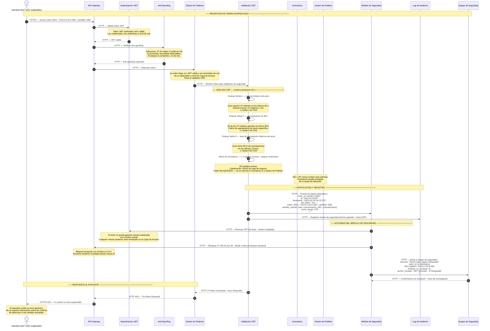

# ASR 2 — Escenario 3: Validación CEP detecta ataque DDoS

**Contexto:** Un actor (bot o tendero suplantado) genera una orden que llega al Gestor de Órdenes habiendo superado la Capa de Acceso con un JWT válido. Durante la validación de seguridad, el analizador CEP detecta patrones anómalos que clasifican la solicitud como un ataque DDoS de capa de negocio — órdenes fantasma para saturar el inventario. La orden **nunca llega** a Inventarios ni al Gestor de Pedidos. En su lugar, se notifica al Módulo de Seguridad con el contexto completo del evento para que tome las acciones correspondientes, incluyendo la revocación del JWT en el componente de Autenticación JWT y el bloqueo de IP en el API Gateway.

**Tácticas activas:**
- Seguridad → **Detectar ataques**: Analizador CEP — detecta denegación de servicio a nivel de negocio
- Seguridad → **Reaccionar — Revocar acceso**: Módulo de Seguridad revoca JWT en Autenticación JWT y bloquea IP en API Gateway
- Seguridad → **Reaccionar — Informar a los actores**: Notificación al equipo de seguridad con contexto forense
- Seguridad → **Recuperarse — Manejo de log de eventos**: Registro del evento en Log de Auditoría independiente
- Disponibilidad → **Prevención**: Inventarios nunca recibe la carga del atacante

---

## Diagrama de secuencia

---

## Notas de arquitectura

| Momento | Decisión | Razonamiento |
|---|---|---|
| JWT válido + Anti-Spoofing no detectan el ataque | La detección es semántica, no de red | El atacante tiene credenciales auténticas y no presenta anomalías de red; la Capa de Acceso no puede detectar este tipo de ataque — la responsabilidad recae en el analizador CEP |
| Orden bloqueada en Validación CEP | Inventarios y Gestor de Pedidos nunca reciben la solicitud | La protección ocurre en el perímetro lógico de negocio; Inventarios queda completamente aislado de la carga del atacante |
| 3 señales del CEP correlacionadas | Motor de correlación ≥ 2 señales = ataque confirmado | Una sola señal puede ser un falso positivo; la correlación de múltiples señales reduce falsos positivos antes de bloquear |
| Revocación del JWT en componente Autenticación JWT | Revocar acceso — desactivación en Capa de Acceso | El Módulo de Seguridad instruye al componente JWT para que invalide el token; cualquier intento posterior del atacante es rechazado antes de llegar a la lógica de negocio |
| Bloqueo de IP en API Gateway | Revocar acceso — bloqueo perimetral | El API Gateway aplica el bloqueo de IP; el tráfico del atacante es descartado en el primer punto de entrada, sin consumir recursos internos |
| Payload completo enviado al Módulo de Seguridad | Informar actores — contexto forense | actor_id, IP, timestamp, token, SKU objetivo y score de riesgo permiten investigación posterior y correlación con otros eventos |
| Bloqueo de IP temporal con revisión | Revocar acceso — sin bloqueo permanente | Un bloqueo permanente automatizado puede generar falsos positivos irreversibles; la revisión en 24 h balancea seguridad y disponibilidad |
| Respuesta genérica 429 al atacante | Limitar la exposición | No revelar los criterios de detección evita que el atacante ajuste su patrón para evadir el sistema |
| Log de Auditoría independiente del Módulo de Seguridad | Recuperarse — Manejo de log de eventos | El log persiste incluso si el Módulo de Seguridad falla; permite análisis forense posterior desacoplado |

> **Relación con el ASR de disponibilidad:** al bloquear la orden antes de que llegue a Inventarios, este escenario es también una táctica de disponibilidad — el módulo nunca recibe la carga artificial del atacante y permanece disponible para órdenes legítimas.

> **Distinción respecto a un DDoS de red tradicional:** el WAF y el API Gateway manejan ataques de volumen a nivel de red/HTTP. Este escenario detecta ataques semánticos donde cada solicitud individual es válida técnicamente — solo el patrón de negocio revela el ataque.
