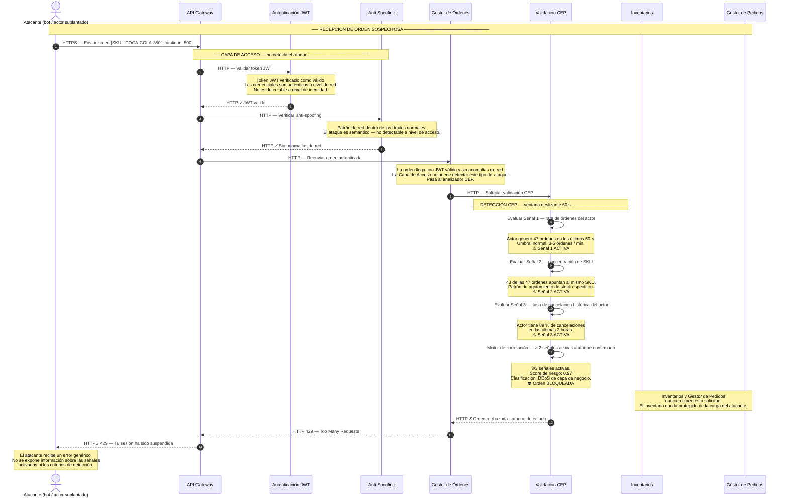

# ASR 2 — Escenario 3 (Solo Detección): Validación CEP detecta ataque DDoS de negocio

**Contexto:** Un actor (bot o tendero suplantado) envía una orden con JWT válido que supera la Capa de Acceso sin ser detectada a nivel de red. Este diagrama muestra únicamente el mecanismo de detección: el analizador CEP evalúa las 3 señales de comportamiento del actor dentro de una ventana deslizante de 60 s, confirma el patrón de ataque y bloquea la orden — antes de que llegue a Inventarios o al Gestor de Pedidos. No se representa ninguna acción de revocación de acceso ni de recuperación.

**Tácticas de detección activas:**
- Seguridad → **Detección**: Analizador CEP — ventana deslizante 60 s · correlación de 3 señales · umbral ≥ 2 señales = ataque confirmado
- Disponibilidad → **Prevención**: Inventarios y Gestor de Pedidos nunca reciben la carga del atacante

---

## Diagrama de secuencia — Solo detección

---

## Notas de arquitectura — Detección

| Momento | Táctica | Detalle |
|---|---|---|
| JWT válido + Anti-Spoofing no detectan el ataque | La detección es semántica, no de red | El atacante tiene credenciales auténticas y no presenta anomalías de red; la Capa de Acceso no puede detectar este tipo de ataque — la responsabilidad recae en el CEP |
| CEP evalúa 3 señales en ventana de 60 s | Detectar ataques — Complex Event Processing | El motor acumula el historial de comportamiento del actor; una sola señal puede ser un falso positivo, la correlación de múltiples señales reduce los falsos positivos |
| Umbral de correlación ≥ 2 señales | Balance precisión vs. sensibilidad | Con umbral de 1 señal se producirían demasiados falsos positivos; con 3 se perdería el ataque con 2 señales; el umbral de 2 es el punto de balance |
| Orden bloqueada antes de llegar a Inventarios y Gestor de Pedidos | Prevención — perímetro lógico de negocio | La protección ocurre en la Validación CEP; Inventarios queda completamente aislado de la carga del atacante y permanece disponible para órdenes legítimas |
| Respuesta genérica 429 al atacante | Limitar la exposición | No revelar los criterios de detección evita que el atacante calibre su patrón para evadir el sistema |

> **Distinción respecto a un DDoS de red tradicional:** el WAF y el API Gateway manejan ataques de volumen a nivel de red/HTTP. Este escenario detecta ataques semánticos donde cada solicitud individual es técnicamente válida — solo el patrón de negocio acumulado en la ventana de 60 s revela el ataque.

> **Alcance de este diagrama:** se muestra únicamente la detección del patrón de ataque y el bloqueo de la orden. Las acciones posteriores (revocación de JWT, bloqueo de IP, alerta al equipo de seguridad) son decisiones de implementación separadas no contempladas en este experimento.
