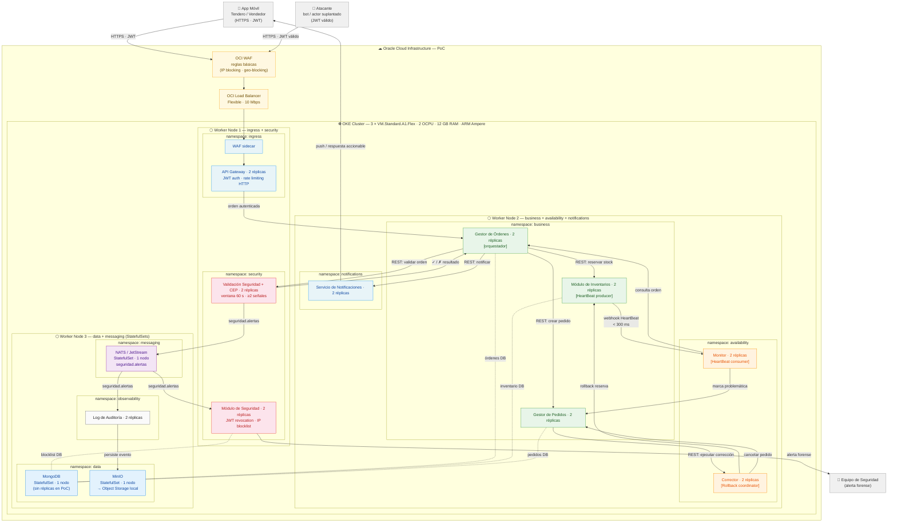
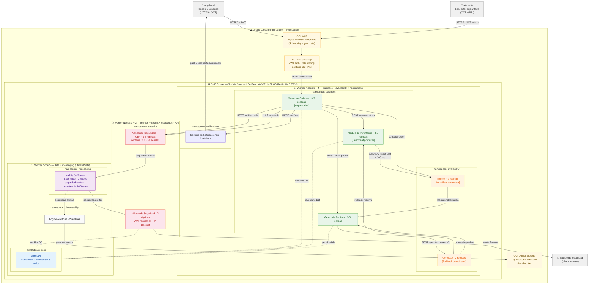
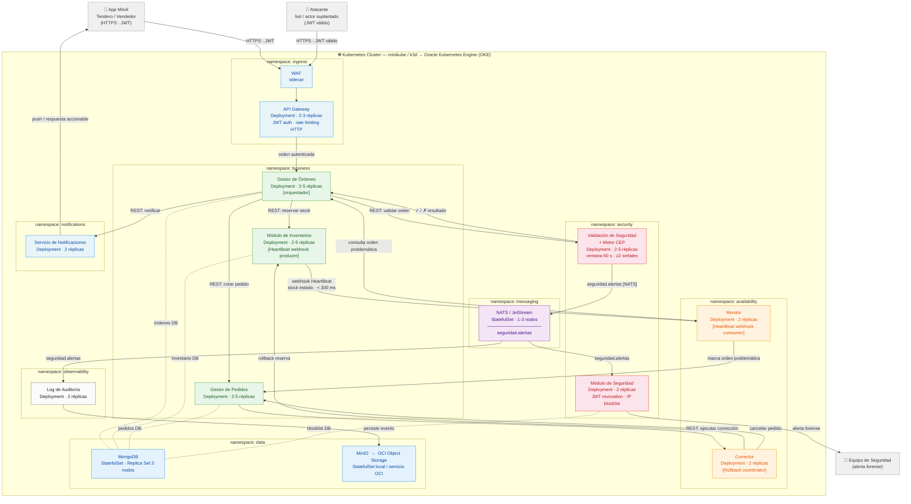

# Diagrama de Despliegue — CCP · Reto 2

> Renderizable en VS Code con la extensión **Markdown Preview Mermaid Support**, o en [mermaid.live](https://mermaid.live).

---

## Diagrama de infraestructura — Ambiente PoC

> 3 Worker Nodes `VM.Standard.A1.Flex` (ARM · 2 OCPU · 12 GB RAM c/u). WAF y API Gateway como servicios OCI gestionados en el perímetro. MinIO auto-gestionado en el clúster para el Log de Auditoría.

---

## Diagrama de infraestructura — Ambiente Producción

> 5 Worker Nodes `VM.Standard.E4.Flex` (x86 · 4 OCPU · 32 GB RAM c/u). OCI API Gateway y OCI WAF gestionados en perímetro. OCI Object Storage reemplaza MinIO. MongoDB en Replica Set de 3 nodos. NATS en StatefulSet de 3 nodos.

---

## Diferencias clave entre ambientes

| Aspecto | PoC | Producción |
|---|---|---|
| **Shape** | `A1.Flex` ARM · 2 OCPU · 12 GB | `E4.Flex` x86 · 4 OCPU · 32 GB |
| **Worker Nodes** | 3 (rol mixto) | 5 (nodos 1-2 dedicados a ingress+security) |
| **API Gateway** | Custom Deployment en OKE | **OCI API Gateway** gestionado |
| **WAF** | Sidecar en pod + OCI WAF básico | **OCI WAF** reglas OWASP completas |
| **Object Storage** | MinIO StatefulSet en Node 3 | **OCI Object Storage** gestionado |
| **MongoDB** | StatefulSet 1 nodo (sin HA) | StatefulSet **Replica Set 3 nodos** |
| **NATS** | StatefulSet 1 nodo | StatefulSet **3 nodos** (HA + JetStream) |
| **Réplicas por servicio** | 2 (mínimo) | 2–5 (con HPA activo) |

---

---

---

## Leyenda de colores

| Color | Namespace |
|---|---|
| Gris | Actores externos |
| Azul claro | `ingress` — API Gateway · WAF · Notificaciones |
| Rojo claro | `security` — Validación CEP · Módulo de Seguridad |
| Verde claro | `business` — Gestor de Órdenes · Inventarios · Pedidos |
| Naranja claro | `availability` — Monitor · Corrector |
| Morado claro | `messaging` — NATS / JetStream (solo flujo de seguridad) |
| Azul medio | `data` — MongoDB · MinIO / OCI Object Storage |
| Gris claro | `observability` — Log de Auditoría |

---

## Flujos principales

| Flujo | ASR | Descripción |
|---|---|---|
| **A** | ASR 1 / 2 | Orden autenticada → GO orquesta → validación VS (sync REST) → reserva INV + pedido GP |
| **B** | ASR 2 | HeartBeat webhook stock negativo → Monitor → corrección → Corrector → rollback < 300 ms |
| **C** | ASR 3 | Ataque DDoS detectado por CEP → publicación NATS → bloqueo · alerta · log forense |
| **D** | ASR 1 / 2 | Notificación al tendero: confirmación o error accionable |

## Decisiones de transporte

| Interacción | Protocolo | Justificación |
|---|---|---|
| GO → VS, GO → INV, GO → GP | REST síncrono | Flujo de negocio principal; simplicidad y trazabilidad |
| INV → MON (HeartBeat) | Webhook HTTP POST | Baja latencia sin intermediario; < 300 ms requeridos |
| GP → CORR (corrección) | REST síncrono | Rollback coordinado; respuesta confirmada necesaria |
| VS → NATS → SEG, LOG | NATS/JetStream pub/sub | Fan-out asíncrono a múltiples consumidores; solo flujo de seguridad |

---

## Infraestructura y Costos — Oracle Cloud Infrastructure (OCI)

> Precios en USD/mes. Basados en tarifa pública OCI (región `us-ashburn-1`). A confirmar con el [OCI Cost Estimator](https://cloud.oracle.com/cost-estimator).

---

### Comparación de ambientes

| Dimensión | PoC | Producción |
|---|---|---|
| **Propósito** | Validación funcional del diseño | Operación real 7×24×365 |
| **Shape de nodo** | `VM.Standard.A1.Flex` (ARM Ampere) | `VM.Standard.E4.Flex` (AMD EPYC) |
| **Configuración por nodo** | 2 OCPU · 12 GB RAM | 4 OCPU · 32 GB RAM |
| **Nodos worker OKE** | 3 nodos | 5 nodos |
| **OCI API Gateway** | Gestionado OCI (bajo tráfico) | Gestionado OCI (alta disponibilidad) |
| **OCI WAF** | Habilitado (reglas básicas) | Habilitado (reglas avanzadas) |
| **NATS / JetStream** | 1 nodo StatefulSet en clúster | 3 nodos StatefulSet en clúster |
| **MongoDB** | StatefulSet 1 nodo (sin réplicas) | StatefulSet Replica Set 3 nodos |
| **OCI Object Storage** | Standard tier (~10 GB/mes) | Standard tier (~50 GB/mes) |
| **Load Balancer** | Flexible (10 Mbps) | Flexible (100 Mbps) |
| **Block Volumes** | 150 GB total | 500 GB total |

---

### Descripción de shapes seleccionados

| Shape | Arquitectura | OCPU | RAM | Precio OCPU/h | Precio GB RAM/h | Justificación |
|---|---|---|---|---|---|---|
| `VM.Standard.A1.Flex` | ARM Ampere | 1–80 | 1–512 GB | $0.010 | $0.0015 | Shape más barato de OCI; ideal para PoC; compatible con imágenes Docker ARM64 |
| `VM.Standard.E4.Flex` | AMD EPYC Milan | 1–64 | 1–1024 GB | $0.025 | $0.0015 | Buena relación precio/rendimiento x86_64; sin cambio de imagen respecto a ambientes locales (minikube) |

> `A1.Flex` también tiene **Always Free Tier**: 4 OCPU + 24 GB RAM total entre instancias — suficiente para un nodo PoC sin costo.

---

### Desglose de costos — PoC

| Componente | Configuración | Cálculo | Costo/mes |
|---|---|---|---|
| **OKE Worker Nodes** | 3 × `A1.Flex` (2 OCPU · 12 GB) | 3 × (2×$0.010 + 12×$0.0015) × 720 h | ~$82 |
| **OCI API Gateway** | ~500 K req/mes | Primero 1 M gratis | $0 |
| **OCI WAF** | Reglas básicas, tráfico bajo | ~$10 fijo + $0.0025/10K req | ~$12 |
| **OCI Object Storage** | 10 GB Standard | $0.0255/GB/mes | ~$1 |
| **Load Balancer Flexible** | 10 Mbps | Tarifa fija | ~$10 |
| **Block Volumes** | 150 GB (MongoDB + NATS) | $0.0255/GB/mes | ~$4 |
| **NATS / JetStream** | 1 Pod en clúster | Incluido en nodos | $0 |
| **MongoDB** | 1 Pod StatefulSet | Incluido en nodos + Block Volume | $0 |
| **Total estimado PoC** | | | **~$109/mes** |

---

### Desglose de costos — Producción

| Componente | Configuración | Cálculo | Costo/mes |
|---|---|---|---|
| **OKE Worker Nodes** | 5 × `E4.Flex` (4 OCPU · 32 GB) | 5 × (4×$0.025 + 32×$0.0015) × 720 h | ~$532 |
| **OCI API Gateway** | ~5 M req/mes | $3.00/M req (primero 1 M gratis) | ~$12 |
| **OCI WAF** | Reglas avanzadas, tráfico alto | ~$25 fijo + uso | ~$30 |
| **OCI Object Storage** | 50 GB Standard | $0.0255/GB/mes | ~$2 |
| **Load Balancer Flexible** | 100 Mbps | Tarifa flexible | ~$18 |
| **Block Volumes** | 500 GB (MongoDB 3 nodos + NATS 3 nodos) | $0.0255/GB/mes | ~$13 |
| **NATS / JetStream** | 3 Pods StatefulSet | Incluido en nodos | $0 |
| **MongoDB Replica Set** | 3 Pods StatefulSet | Incluido en nodos + Block Volume | $0 |
| **Total estimado Producción** | | | **~$607/mes** |

> ⚠️ Producción puede optimizarse con **Reserved Instances OCI** (compromiso 1 año): descuento ~36% sobre tarifa on-demand → ~$388/mes.

---

### Decisiones de infraestructura

| # | Decisión | Detalle | Justificación |
|---|---|---|---|
| **INF-01** | Shape ARM para PoC | `VM.Standard.A1.Flex` (2 OCPU / 12 GB) | Es el shape más económico de OCI; imágenes Docker multi-arch disponibles para todos los servicios del stack (NATS, MongoDB, servicios custom) |
| **INF-02** | Shape x86 para Producción | `VM.Standard.E4.Flex` (4 OCPU / 32 GB) | Compatibilidad garantizada con cualquier imagen OCI sin preocuparse por soporte ARM; mejor perfil CPU para cargas de validación CEP intensivas |
| **INF-03** | OCI API Gateway gestionado | Reemplaza el API Gateway custom en Producción | Elimina la operación del Deployment propio; integra nativamente con OCI WAF, IAM y políticas de rate limiting sin configuración adicional |
| **INF-04** | OCI WAF en perímetro | Habilitado en ambos ambientes | Protección DDoS volumétrica de capa HTTP/red antes de llegar al clúster; en PoC con reglas básicas (IP blocking, geo-blocking); en Producción con reglas OWASP completas |
| **INF-05** | OCI Object Storage para Log de Auditoría | Reemplaza MinIO en Producción | Almacenamiento inmutable gestionado, sin StatefulSet que operar; costo mínimo (~$0.025/GB/mes); cumple el requisito forense de persistencia independiente |
| **INF-06** | MongoDB auto-gestionado en OKE | StatefulSet con Block Volumes OCI | Evita el costo de OCI Database Service (~$200+/mes adicionales); suficiente para el volumen académico/PoC y escalable en Producción |
| **INF-07** | NATS auto-gestionado en OKE | StatefulSet, sin servicio OCI equivalente | OCI no ofrece NATS como servicio gestionado; JetStream en StatefulSet es suficiente para el único topic `seguridad.alertas` |
| **INF-08** | Reserved Instances en Producción | Compromiso 1 año sobre nodos E4.Flex | Reduce ~36% el costo de compute; aplicable cuando el diseño esté estabilizado post-PoC |
| **INF-09** | Portabilidad minikube → OKE | Mismos manifiestos K8s; swap de StorageClass y servicios OCI | La única diferencia entre PoC local y nube es: `StorageClass` (local-path → oci-bv), `MinIO` → OCI Object Storage, `WAF sidecar` → OCI WAF, `API GW custom` → OCI API Gateway |
