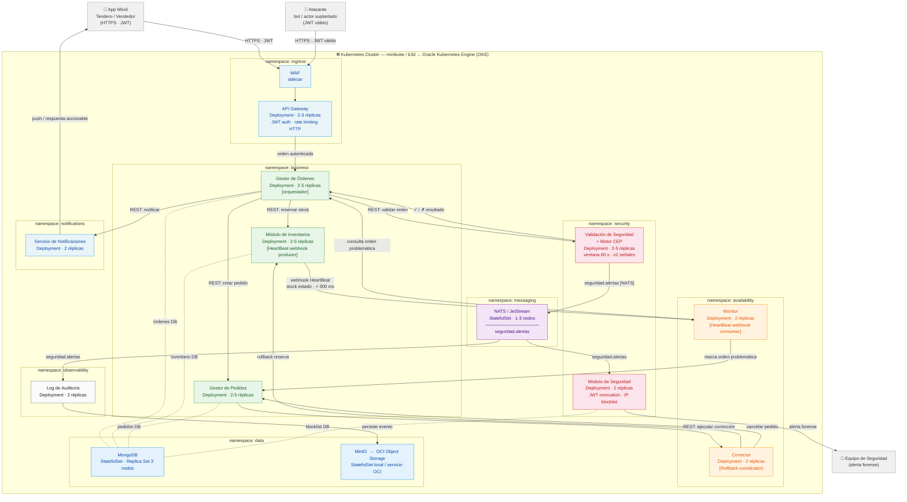

# Diagrama de Despliegue — CCP · Reto 2

> Renderizable en VS Code con la extensión **Markdown Preview Mermaid Support**, o en [mermaid.live](https://mermaid.live).

---

---

## Leyenda de colores

| Color | Namespace |
|---|---|
| Gris | Actores externos |
| Azul claro | `ingress` — API Gateway · WAF · Notificaciones |
| Rojo claro | `security` — Validación CEP · Módulo de Seguridad |
| Verde claro | `business` — Gestor de Órdenes · Inventarios · Pedidos |
| Naranja claro | `availability` — Monitor · Corrector |
| Morado claro | `messaging` — NATS / JetStream (solo flujo de seguridad) |
| Azul medio | `data` — MongoDB · MinIO / OCI Object Storage |
| Gris claro | `observability` — Log de Auditoría |

---

## Flujos principales

| Flujo | ASR | Descripción |
|---|---|---|
| **A** | ASR 1 / 2 | Orden autenticada → GO orquesta → validación VS (sync REST) → reserva INV + pedido GP |
| **B** | ASR 2 | HeartBeat webhook stock negativo → Monitor → corrección → Corrector → rollback < 300 ms |
| **C** | ASR 3 | Ataque DDoS detectado por CEP → publicación NATS → bloqueo · alerta · log forense |
| **D** | ASR 1 / 2 | Notificación al tendero: confirmación o error accionable |

## Decisiones de transporte

| Interacción | Protocolo | Justificación |
|---|---|---|
| GO → VS, GO → INV, GO → GP | REST síncrono | Flujo de negocio principal; simplicidad y trazabilidad |
| INV → MON (HeartBeat) | Webhook HTTP POST | Baja latencia sin intermediario; < 300 ms requeridos |
| GP → CORR (corrección) | REST síncrono | Rollback coordinado; respuesta confirmada necesaria |
| VS → NATS → SEG, LOG | NATS/JetStream pub/sub | Fan-out asíncrono a múltiples consumidores; solo flujo de seguridad |
