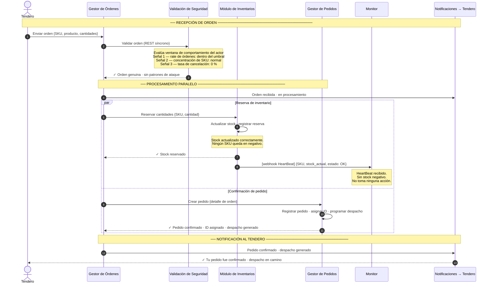

# ASR — Escenario 1: Flujo exitoso (HeartBeat OK)

**Contexto:** El tendero genera una orden válida. La validación de seguridad no detecta patrones de ataque, el inventario es suficiente para cubrir las cantidades solicitadas y el módulo de inventarios nunca emite un HeartBeat de stock negativo. El Monitor y el Corrector no entran en acción.

**Tácticas activas:**
- Disponibilidad → **Detección**: HeartBeat — Inventario emite webhook de estado al Monitor; en este escenario nunca reporta stock negativo
- Seguridad → **Detección**: Validación de seguridad (DDoS / orden fantasma) antes de procesar
- Seguridad → **Resistir**: Orden no pasa a inventario ni a pedidos sin superar la validación

---

## Diagrama de secuencia

---

## Notas de arquitectura

| Elemento | Táctica | Detalle |
|---|---|---|
| Gestor de Órdenes como orquestador | Separación de responsabilidades | GO recibe la orden, delega validación a VS y luego coordina INV y GP; ningún servicio llama a otro por fuera de esta cadena |
| Validación de seguridad síncrona | Detectar ataques — CEP | GO espera la respuesta de VS antes de continuar; la orden no llega a inventario ni pedidos sin pasar la validación |
| HeartBeat como webhook | Detectar fallas — HeartBeat | INV hace un HTTP POST al Monitor tras cada operación de stock; en este escenario el estado es OK y el Monitor no actúa |
| Monitor sin acción | Detectar fallas — Monitor | Recibe el HeartBeat pero no detecta anomalías; su ausencia en el flujo activo indica que el sistema opera correctamente |
| Procesamiento paralelo | Preparación — Reconfiguración | La reserva de inventario y la creación del pedido ocurren simultáneamente para minimizar latencia |
| Notificación en dos momentos | Experiencia del actor | El tendero recibe primero "orden recibida" y luego "despacho generado", sin esperar todo el flujo |

> **El Monitor y el Corrector están activos en todo momento** — simplemente no tienen eventos que procesar en este escenario. Su ausencia en el flujo activo es el indicador de que el sistema opera correctamente.
