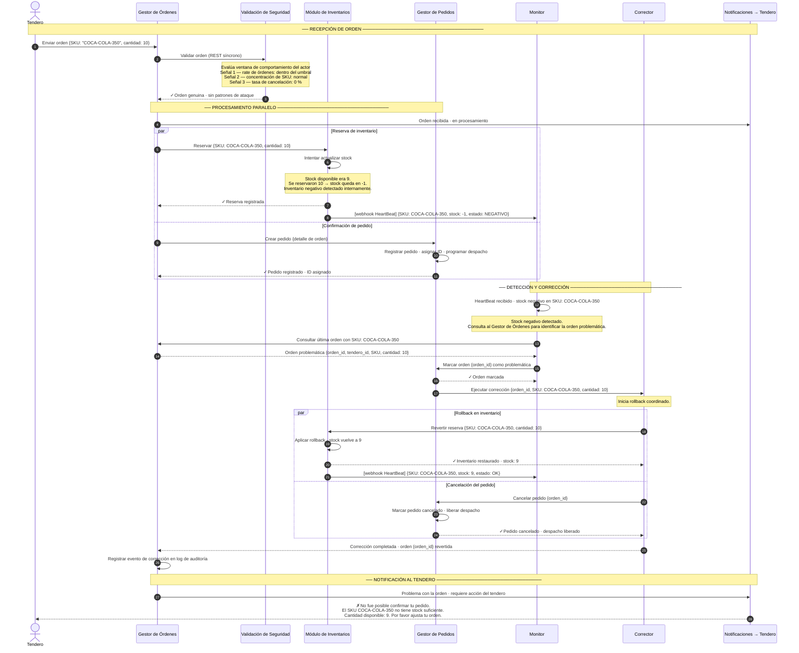

# ASR — Escenario 2: HeartBeat detecta inventario negativo → Corrección y rollback

**Contexto:** El tendero genera una orden que pasa la validación de seguridad, pero al reservar el inventario un SKU queda en negativo — se reservó más de lo que había. El módulo de inventarios lo detecta internamente y notifica al Monitor vía webhook HeartBeat. El Monitor recupera la orden problemática del Gestor de Órdenes, activa la cadena de corrección a través del Gestor de Pedidos y el Corrector ejecuta el rollback en paralelo. El tendero recibe un mensaje accionable.

**Tácticas activas:**
- Disponibilidad → **Detección**: HeartBeat — Inventario envía webhook de stock negativo al Monitor en < 300 ms
- Disponibilidad → **Enmascarar**: El tendero recibe una respuesta controlada, sin exponer el error interno
- Disponibilidad → **Corregir**: Monitor activa cadena Gestor de Pedidos → Corrector → rollback paralelo
- Seguridad → **Detección**: Validación de seguridad (DDoS / orden fantasma) — pasa en este escenario
- Seguridad → **Reaccionar**: Log del evento de corrección para análisis posterior

---

## Diagrama de secuencia

---

## Notas de arquitectura

| Momento | Decisión | Razonamiento |
|---|---|---|
| INV envía HeartBeat vía webhook | Detectar fallas — HeartBeat | HTTP POST directo al Monitor; sin intermediario de mensajería; latencia mínima para cumplir < 300 ms |
| Monitor consulta GO para correlacionar | Correlación del evento | El SKU en el HeartBeat permite identificar qué orden generó el problema; GO es la fuente de verdad de órdenes |
| GP activa al Corrector (no el Monitor) | Corrector desacoplado | El Corrector es reutilizable para otros escenarios de rollback sin depender del flujo HeartBeat específico (ADR-03) |
| Rollback paralelo en inventario y pedidos | Corregir — Rollback coordinado | Ambas correcciones deben ejecutarse; hacerlas en paralelo reduce el tiempo que el stock permanece en negativo |
| Tendero notificado sin exponer el error | Enmascarar — respuesta controlada | El cliente recibe mensaje accionable (cantidad disponible = 9) sin ver trazas internas del sistema |
| Log de auditoría en Gestor de Órdenes | Recuperarse — Manejo de log de eventos | Permite análisis forense posterior y detección de patrones recurrentes |

> **Ventana de tiempo en negativo:** existe un intervalo entre que el inventario queda en negativo y el Corrector aplica el rollback. Este intervalo debe minimizarse con un HeartBeat de baja latencia (< 300 ms). Durante ese intervalo, el stock negativo es interno al sistema y no visible al tendero.

> **El Corrector como componente desacoplado:** recibe la orden del Gestor de Pedidos, no del Monitor directamente. Esto permite que el Corrector sea reutilizable para otros escenarios de rollback sin depender del flujo de detección específico.
