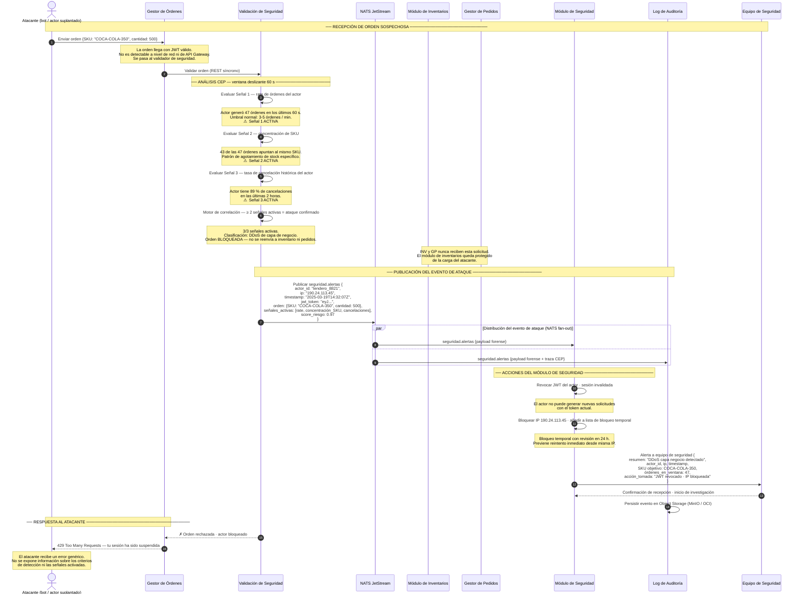

# ASR — Escenario 3: Validación de seguridad detecta ataque DDoS

**Contexto:** Un actor (bot o tendero suplantado) genera una orden que llega al Gestor de Órdenes. Durante la validación de seguridad, el analizador CEP detecta patrones anómalos que clasifican la solicitud como un ataque DDoS de capa de negocio — órdenes fantasma para saturar el inventario. La orden **nunca llega** al módulo de inventarios ni al Gestor de Pedidos. En su lugar, la Validación de Seguridad publica el evento de ataque en NATS/JetStream, desde donde el Módulo de Seguridad y el Log de Auditoría lo consumen de forma independiente.

**Tácticas activas:**
- Seguridad → **Detectar ataques**: Analizador CEP — detecta denegación de servicio a nivel de negocio
- Seguridad → **Reaccionar — Revocar acceso**: Módulo de Seguridad bloquea al actor
- Seguridad → **Reaccionar — Informar a los actores**: Notificación al equipo de seguridad con contexto forense
- Seguridad → **Recuperarse — Manejo de log de eventos**: Registro del evento para análisis posterior
- Disponibilidad → **Prevención**: El módulo de inventarios nunca recibe la carga del atacante

---

## Diagrama de secuencia

---

## Notas de arquitectura

| Momento | Decisión | Razonamiento |
|---|---|---|
| Orden bloqueada en Validación de Seguridad | Inventario y Pedidos nunca reciben la solicitud | La protección ocurre en el perímetro lógico de negocio; el módulo de inventarios queda completamente aislado de la carga del atacante |
| NATS/JetStream exclusivo para seguridad | Bus de eventos de alcance limitado | Solo el flujo de alertas de seguridad usa mensajería asíncrona; el resto del sistema opera con REST síncrono |
| Fan-out NATS → SEG y LOG en paralelo | Módulo de Seguridad y Log de Auditoría desacoplados | Ambos consumen el mismo evento independientemente; si uno falla, el otro persiste el registro |
| 3 señales del CEP correlacionadas | Motor de correlación ≥ 2 señales = ataque confirmado | Una sola señal puede ser un falso positivo; la correlación reduce falsos positivos antes de bloquear |
| JWT válido no garantiza orden legítima | La detección es semántica, no de red | El atacante tiene credenciales válidas; el WAF y el API Gateway no detectan este tipo de ataque |
| Bloqueo de IP temporal con revisión | Revocar acceso — sin bloqueo permanente | Un bloqueo permanente automatizado puede generar falsos positivos irreversibles; la revisión en 24 h balancea seguridad y disponibilidad |
| Respuesta genérica 429 al atacante | Limitar la exposición | No revelar los criterios de detección evita que el atacante ajuste su patrón para evadir el sistema |
| Log de Auditoría independiente del Módulo de Seguridad | Recuperarse — Manejo de log de eventos | El log persiste incluso si el Módulo de Seguridad falla; permite análisis forense posterior desacoplado |

> **Relación con el ASR de disponibilidad:** al bloquear la orden antes de que llegue al inventario, este escenario es también una táctica de disponibilidad — el módulo de inventarios nunca recibe la carga artificial del atacante y permanece disponible para órdenes legítimas.

> **Distinción respecto a un DDoS de red tradicional:** el WAF y el API Gateway manejan ataques de volumen a nivel de red/HTTP. Este escenario detecta ataques semánticos donde cada solicitud individual es válida técnicamente — solo el patrón de negocio revela el ataque.
